<!doctype html>
<html>
  <head>
    <meta charset="utf-8">
    <meta name="viewport" content="width=device-width, initial-scale=1.0, user-scalable=yes">
    <link rel="stylesheet" href="/bower_components/bootstrap/dist/css/bootstrap.min.css">
    <link rel="stylesheet" href="help.css">
  </head>
  <title>云立方学院帮助中心</title>
  <body>

  

    

      <a href="/" class="navbar-brand">
        云立方学院
      </a>
    

    <ul class="nav navbar-nav navbar-left">
      <li>
        <a href="//www.cloud3edu.com/blog" target="blank">博客</a>
      </li>
    </ul>
  

[TOC]

  
  

# 管理员功能
管理员主要负责机构管理，教师和班级学生管理，以及专业管理

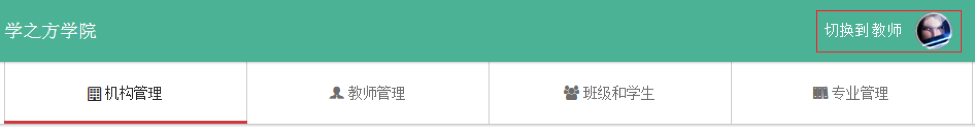

***注：管理员同时也可以是老师，点击“切换到教师”即可去往教师页面。教师页面功能请参考教师功能部分***。

### 一、机构管理
机构管理分为机构基本信息、机构公告区
##### 1、添加机构基本信息
机构基本信息区内可以修改机构全称等基本信息。点击“升级为高级用户”按钮可以发邮件给学之方，联系付费升级事宜。（免费用户上传视频有大小限制，）

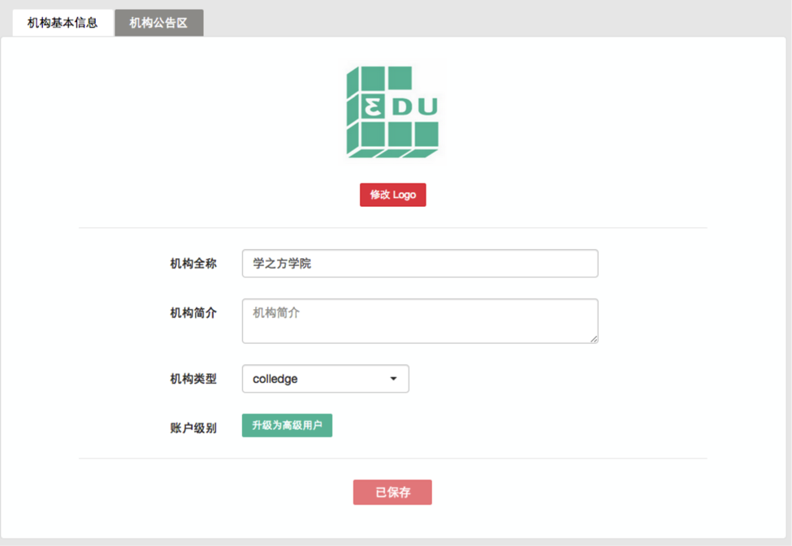

##### 2、发布机构公告
机构公告区内可以发送公告给整个机构。

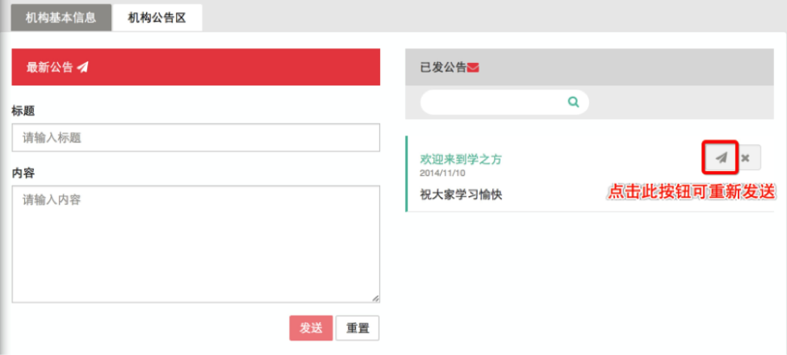

### 二、教师管理

##### 1、单独添加教师。

如下图。填入所需的教师信息。

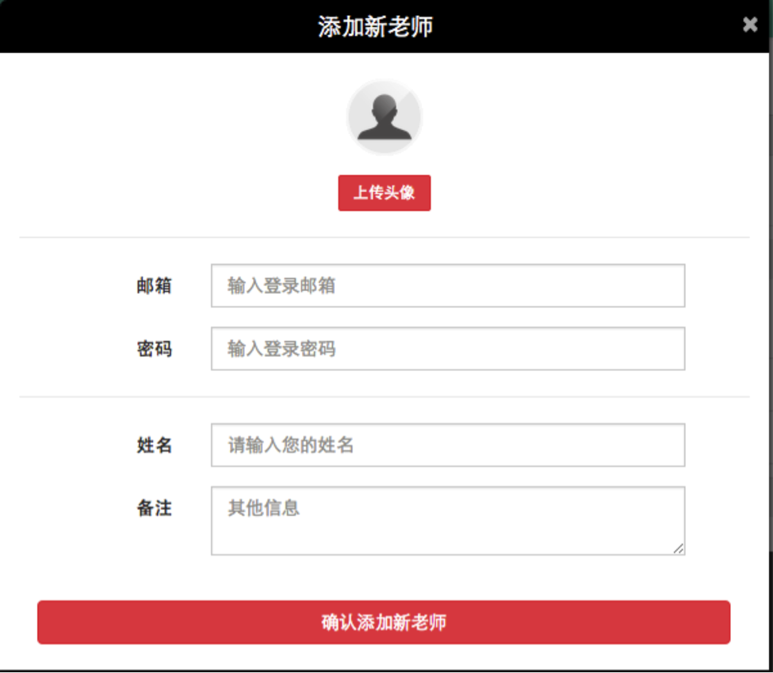

##### 2、批量添加教师。
批量添加教师需要上传excel文件（.xlsx）。文件内容格式为：

第一栏为用户姓名，第二栏为用户电子邮件。导入完成后系统会自动发邀请邮件给导入的电子邮件。用户收到邀请邮件后，点击激活链接即可登录云立方学院系统。用户的默认密码与电子邮件相同，我们推荐用户登录后立即修改密码。
### 三、班级和学生管理

##### 1、添加/删除班级
点击添加按钮创建新的班级。在班级列表中勾选班级然后点击删除按钮删除班级。删除班级不会把班级里的学生删掉，没有班级的学生会被划归到“未分班的学生”组内。

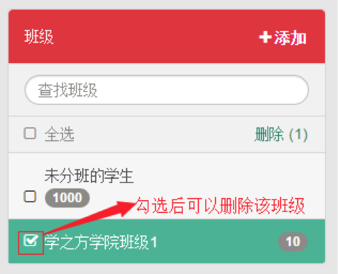
##### 2、单独添加或批量导入学生。
方法和教师管理相同。

##### 3、删除学生。
在一个班级内勾选学生后，会出现删除按钮，点击后弹出提示（如下图）。“系统中删除”是指从系统中彻底删除该学生。“该组内删除”只会把该学生从该班级内移除。

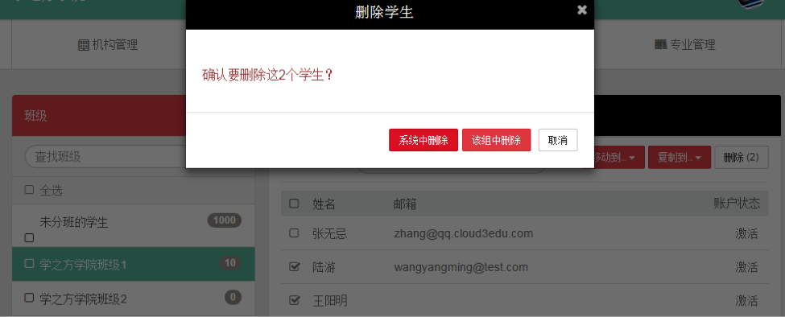

##### 4、移动/复制学生到其他班级。

在一个班级内勾选学生后，可以把学生移动或复制到另外的班级。

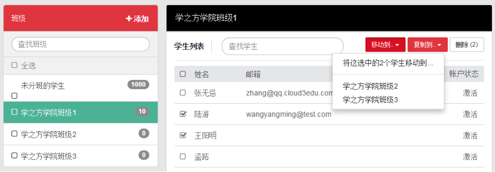

### 四、专业管理
##### 1、添加专业。
点击添加专业按钮可添加新专业。
##### 2、查看某专业内的课程列表。
选择专业列表中的一个专业，可以查看该专业的所有课程。

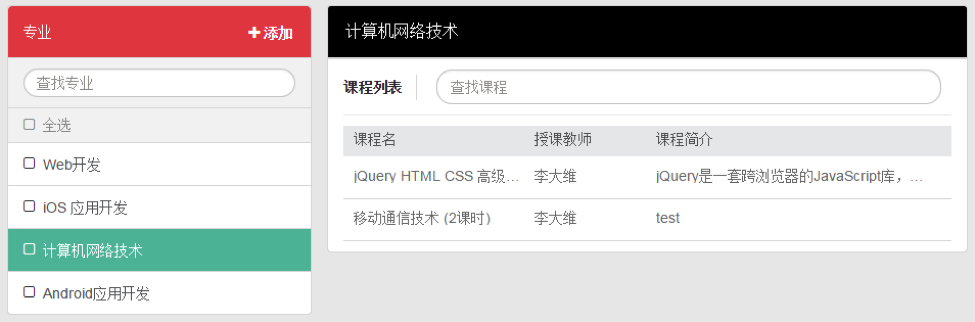

##### 3、课程统计信息。

点击具体课程可查看该课程的统计信息

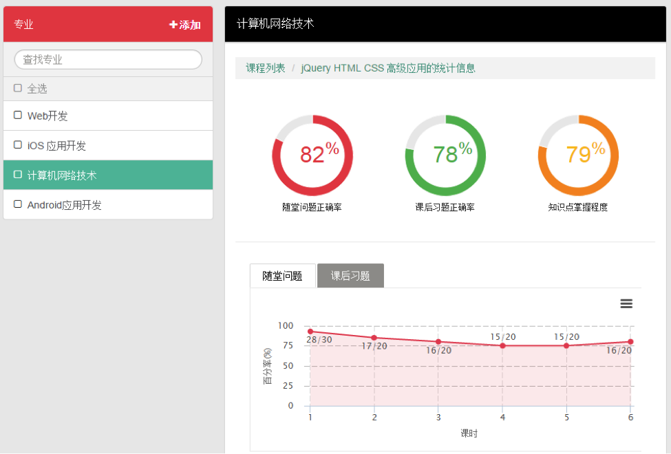

# 教师功能

### 一、课前准备

##### 1、添加课程。

教师登录之后，首页中点击“添加新课程”可以创建新课程。

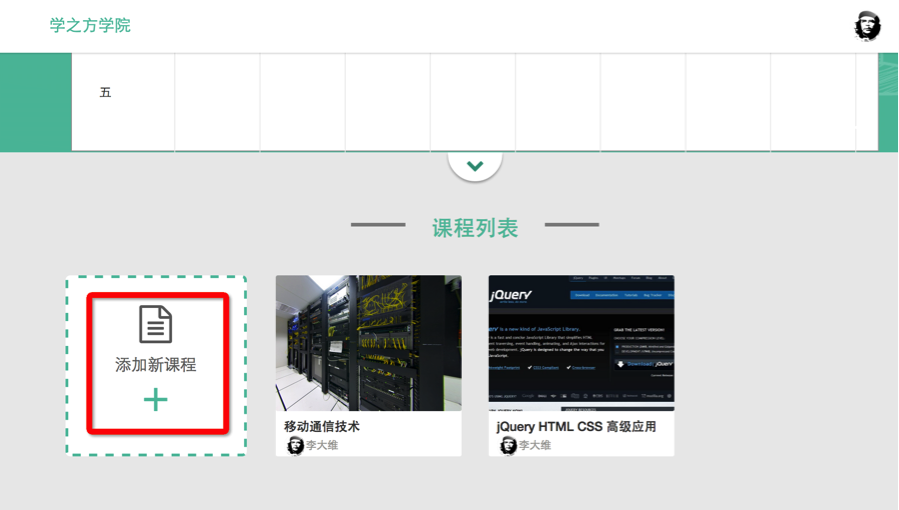

在创建新课程表中，可以添加课程名称，所在专业，以及课程信息，并且可以上传课程封面。

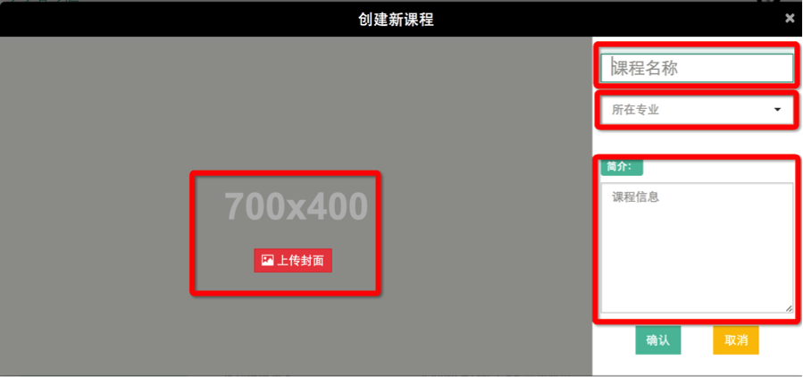

##### 2、课程关联班级和创建新课时

课程创建后，教师可以在课程主页的左下方班级列表中选择班级，所选的班级会自动关联到该课程。一门课程可以关联多个班级。

在课时列表的右上角，点击添加课时按钮，教师可以为课程创建新的课时。
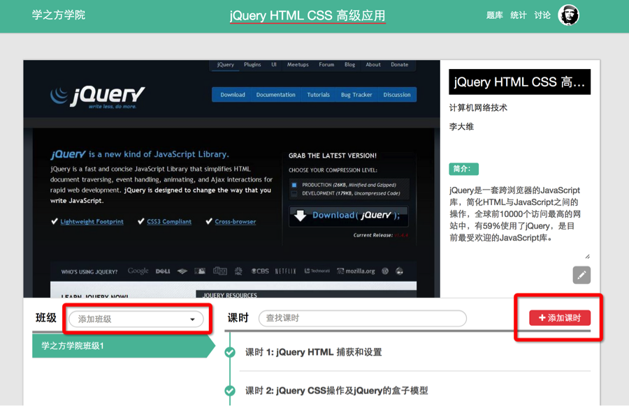
##### 3、制作课时教学内容
在课时页面，教师可以制作添加课时内容：包括上传教学视频，讲义PPT或跟教学相关的文件。目前支持PPT，WORD和PDF文件格式。

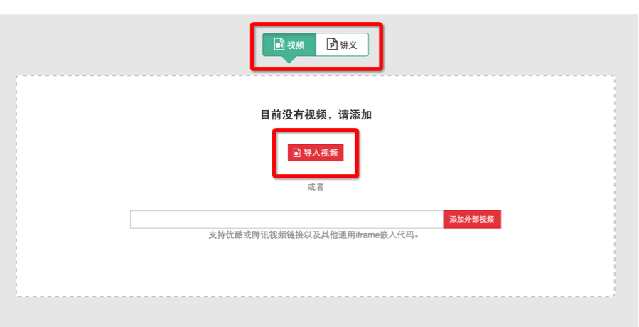

##### 4、制作随堂练习和课后作业

在课时页面，教师可以制作随堂练习和课后作业。随堂练习是教师在讲课界面中（请看上课界面详细介绍）随时推送给学生的题目。课后作业是课后学生独立完成的作业。目前随堂练习和课后作业支持选择题类型题目。

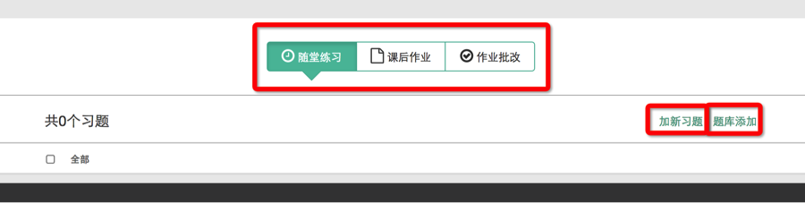

教师可以选择添加新习题，也可以选择从题库中添加。如果选择添加新习题，可以点击“加新习题”按钮，弹出创建习题对话框。问题的题干部分可以是文字或者包含图片。需要至少标记一个选项为正确答案。同时教师可以关联知识点到当前问题，并且提供问题的详细解答。正确答案和详细解答只有当学生提交答案后才在学生界面上显示。

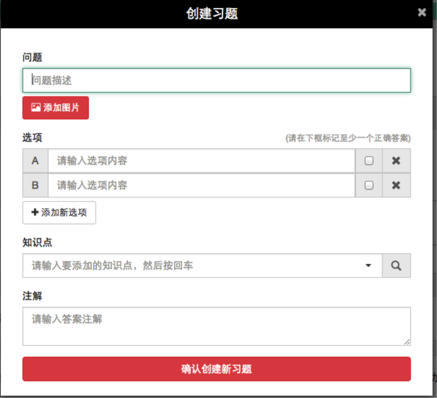

**注：教师创建的题目会自动进入机构题库。同一个机构内，相同专业下的不同课程的题库是共享的。**

如选择从题库添加习题，可点击“题库添加”按钮。在题库界面中教师可以选择一道或多道题目，将其加入随堂练习或课后作业中。在题库界面可以通过关键字来搜索题目，也可以通过知识点来筛选题目。

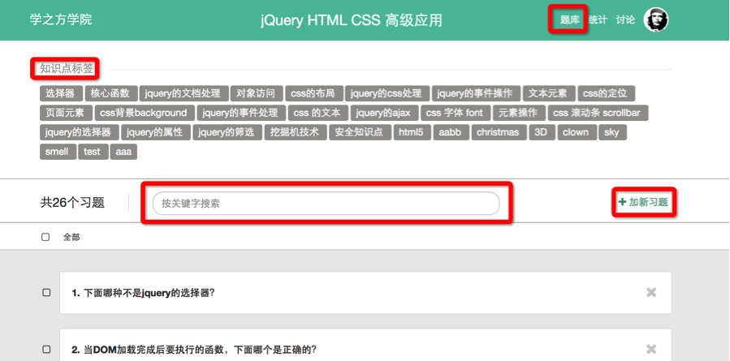

### 二、上课模式

##### 1、进入上课模式

教师可以从课程主页或课时页面进入上课模式界面。在课程页面中，教师先在班级列表中选择要上课的班级，然后在右侧对应的课时列表中，点击课时左侧的小图标，进入上课界面。

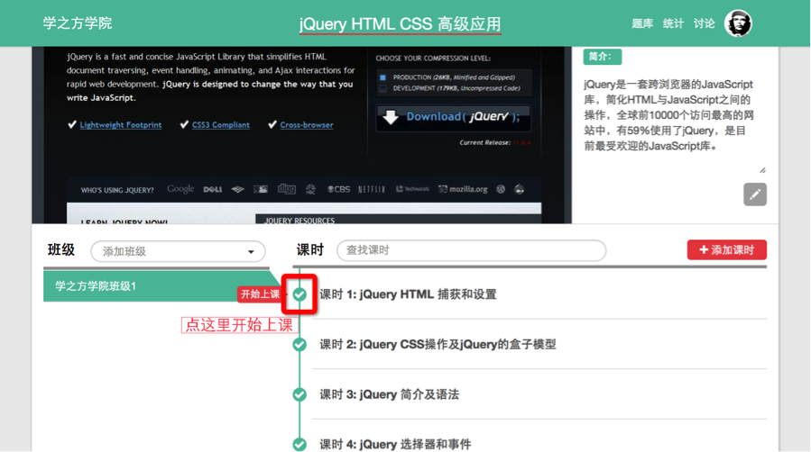

  

在课时界面，教师可以点击“开始上课”按钮，选择要上课的班级，进入上课模式。

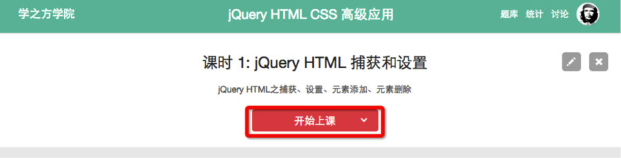

##### 2、上课模式功能

进入上课模式界面后，教师可以展示和讲解讲义PPT或其它文档，并且可以随时从课前准备的随堂练习中选择题目推送给学生。学生可在自己的电脑或移动设备上回答，教师会收到所有学生的实时回答情况。

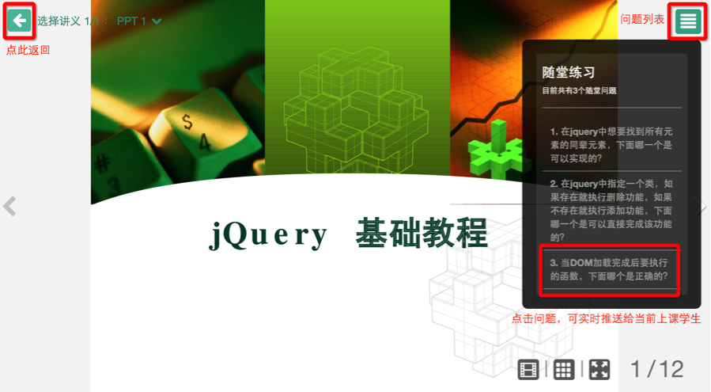

  

下图是教师点击开始提问后看到的学生实时回答统计的情况。包括有多少学生提交了答案，每个选项的人数统计。

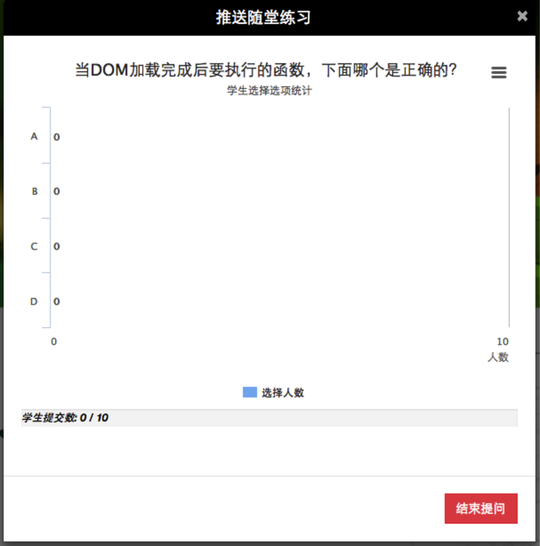

### 三、课后查看统计

##### 1、查看随堂练习和课后作业统计

教师可以进入课时页面，查看每个随堂练习或者课后作业的回答统计。统计信息包括回答正确率统计，选项分布，以及每一个学生的回答情况。

##### 2、批改学生作业

对于不便用选择题形式呈现的作业题目。系统支持学生上传文件提交作业，教师可以在课时页面的作业批改界面里完成批改工作。

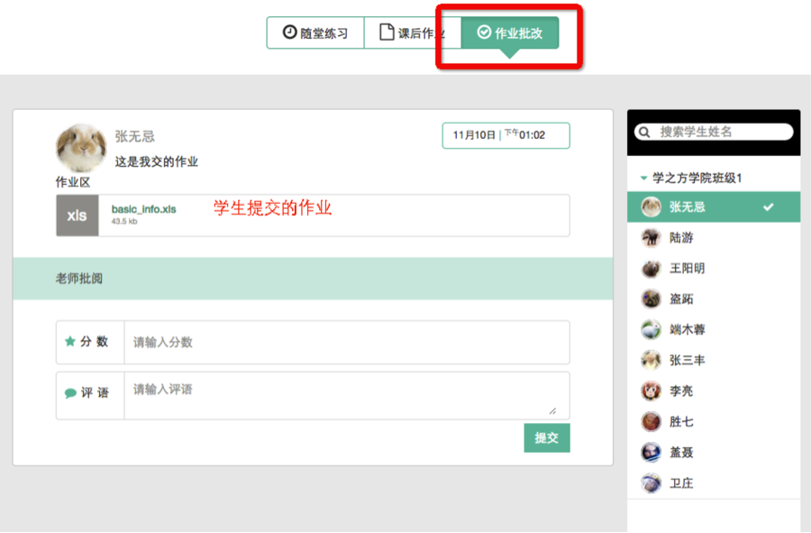

##### 3、查看课程统计

教师可以随时查看整个课程的统计。统计数据包括随堂问题正确率，课后习题正确率，以及知识点掌握度。数据既包含整体课程，也包含具体每一个课时的数据，以及每一个知识点的数据。教师可以从右侧的班级列表中选择学生，查看该学生的统计数据。

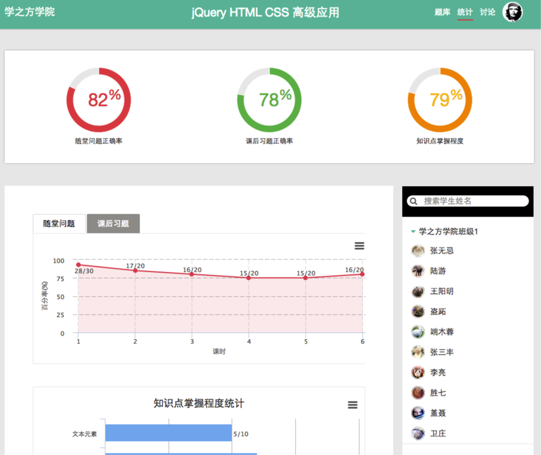

# 学生功能

### 一、学习课程

##### 1、进入课程

学生登录系统后，可以看到自己正在学习的课程和课程表。
 

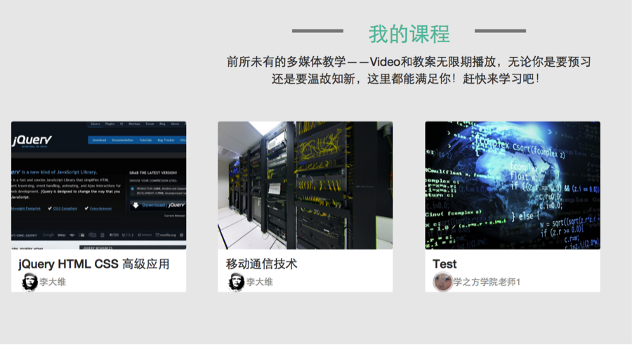

点击课程进入课程主页。进入课程主页后，可以看到课程教师，课程简介，以及课程学习进度，以及课时列表。可以点击继续学习按钮进入到当前正在学习的课时，也可以直接点击某个课时进入并开始学习。

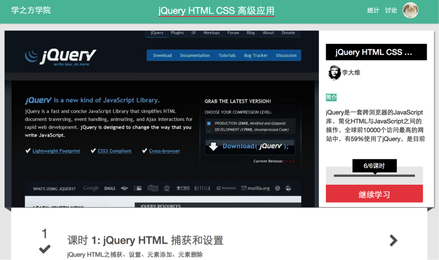

##### 2、进入课程

进入课时页面后，学生可以观看教学视频，或者浏览教学PPT。

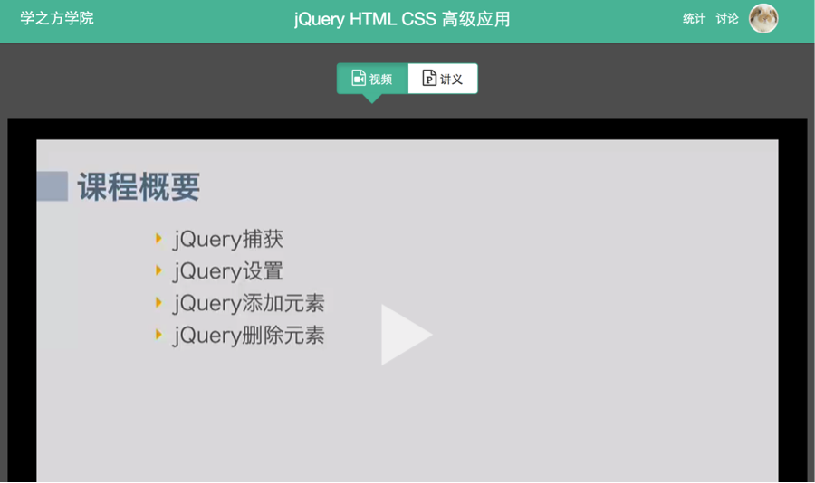

学生还可以复习教师在课堂上发布的随堂问题，以及完成课后作业习题。目前课后作业支持选择题。 
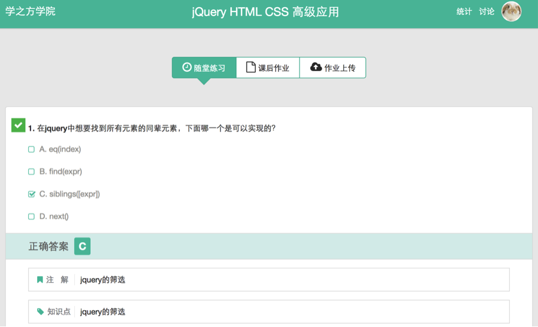

##### 3、上传作业
如果学生需要提交其它类型的作业，可以选择上传作业文件，如图片等，并提交给教师批阅
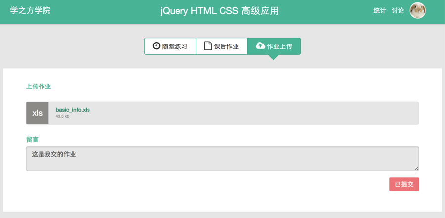
##### 4、查看个人统计
学生可以点击统计进入自己的学习统计界面。统计界面中显示学生本门课程的统计信息。统计信息包括课程的总体统计信息，以及每个课时的趋势变化。统计信息还包括学生对课程中的知识点掌握情况。
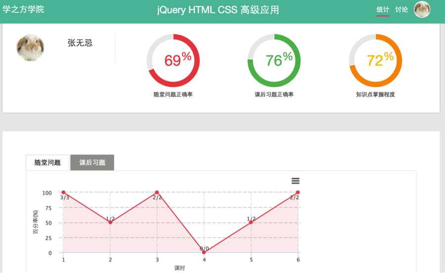

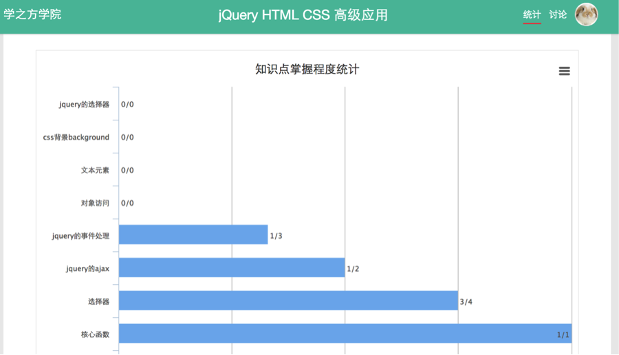

# 通用功能

### 一、个人设置

登录后点击用户头像，再点击个人设置。

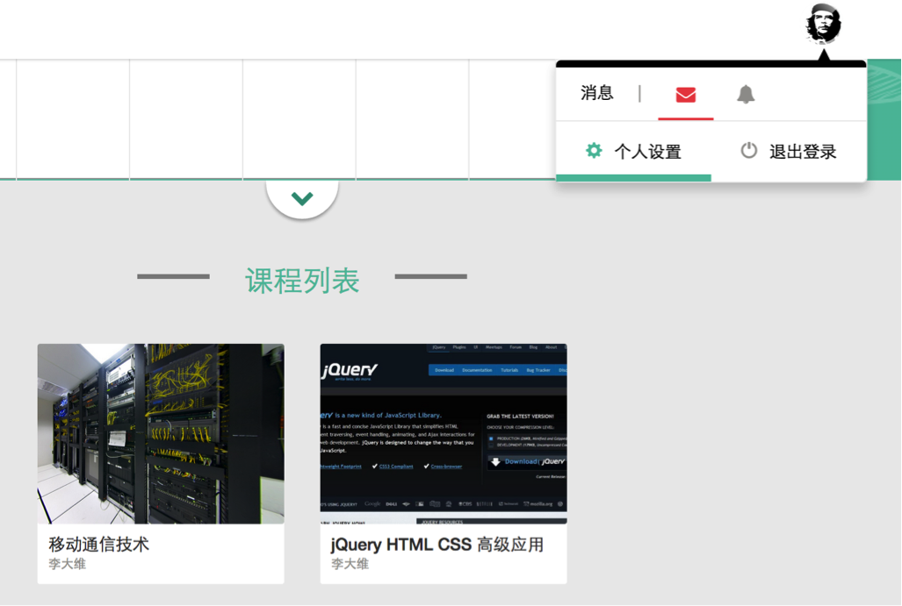

 
进入个人设置页面后，可修改个人设置数据，包括头像，姓名，邮箱以及密码。修改头像是，可以手动裁剪上传的图片中想要的部分。
 

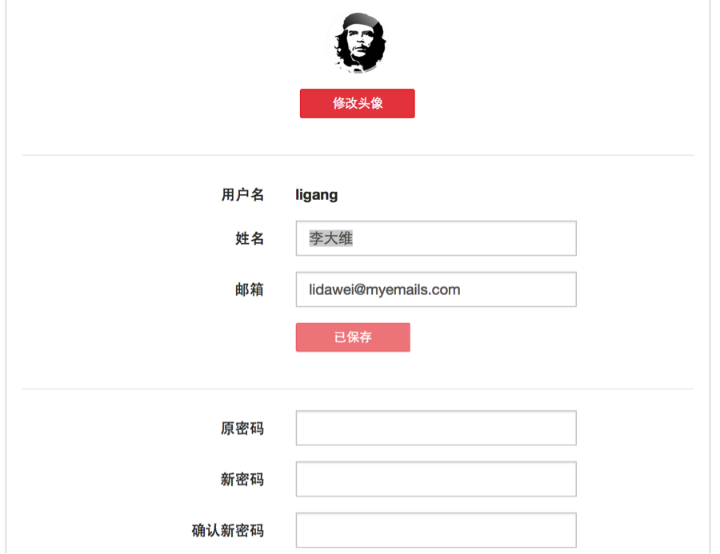

### 二、查看讨论区及提问

进入课程讨论区后，可点击新讨论按钮发起新的讨论主题。

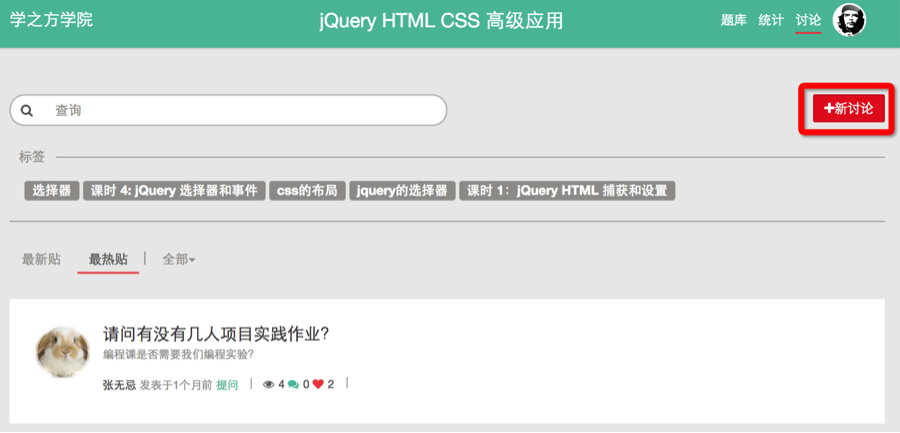
 

在讨论主题编辑框中，可以指定讨论主题，类型(目前支持提问和公告类型)，并可以将该主题与一个或多个课时及知识点关联起来，便于大家查找和分类。点击编辑框的左下角的图片icon，可以在讨论内容中插入图片。

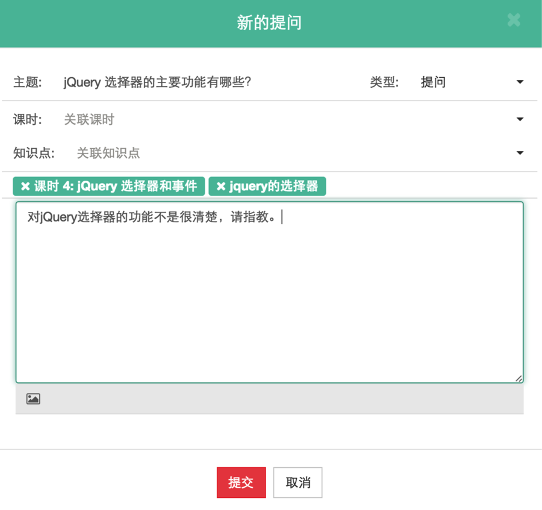

在讨论区中，用户可以点击某一个主题查看主题细节，也可以点赞或回复主题。
  

  </body>
</html>

