<!doctype html>
<html>
  <head>
    <meta charset="utf-8">
    <meta name="viewport" content="width=device-width, initial-scale=1.0, user-scalable=yes">
    <link rel="stylesheet" href="/bower_components/bootstrap/dist/css/bootstrap.min.css">
    <link rel="stylesheet" href="help.css">
  </head>
  <title>云立方学院帮助中心</title>
  <body>

  

    

      <a href="/" class="navbar-brand">
        云立方学院
      </a>
    

    <ul class="nav navbar-nav navbar-left">
      <li class="active">
        <a href="#" >帮助中心</a>
      </li>
    </ul>
  

[TOC]

  
  

# 欢迎使用云立方学院
欢迎使用云立方学院！通过简单的注册，您将可以迅速创建自己的机构，拥有自己独立入口和品牌的互联网教学平台。

在使用过程当中，如有任何问题，请随时联系我们：

[info@cloud3edu.com](mailto:info@cloud3edu.com)

首先，需要在我们的主页上输入管理员邮箱和密码，点击机构注册：

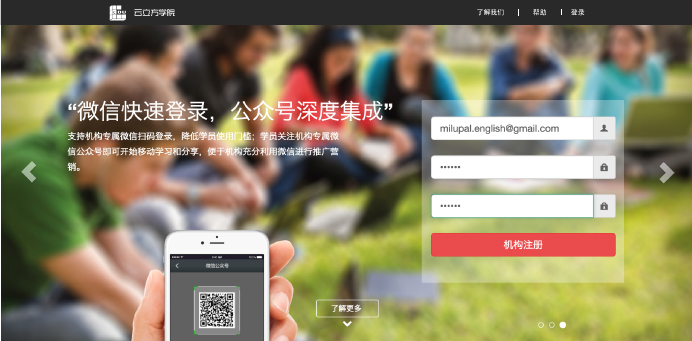

进入机构注册页面后，需要填写机构名称，机构唯一标识，机构所在地。其中机构唯一标识必须是一个由字母，数字和"－"组成的一个独特的名字。

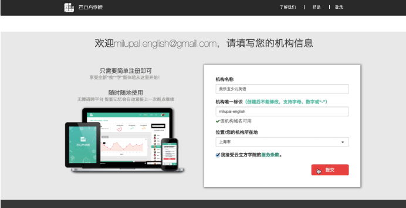

完成机构信息后，机构管理员会收到一封来自云立方学院的激活邮件：

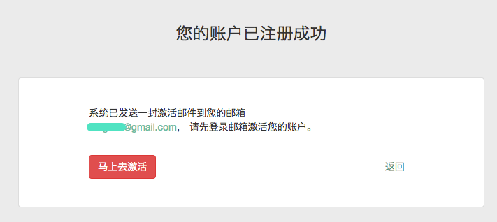

在邮件中点击激活链接即可进入管理员界面

  

# 管理员功能
管理员主要负责机构的相关设置和管理，包括机构信息，机构主页定制，支付信息，教师管理，专业管理，开班管理等等。下面是管理员功能的详细信息。

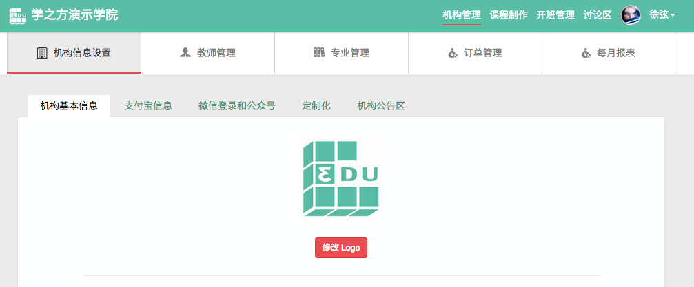

***注：管理员同时也可以是老师，教师页面功能请参考教师功能部分***。

### 一 机构信息设置
机构设置包括机构基本信息，支付信息，微信登录和公众号信息，机构首页定制化和机构公告区

##### 1. 添加机构基本信息

机构基本信息区内可以修改机构logo，名称等基本信息。

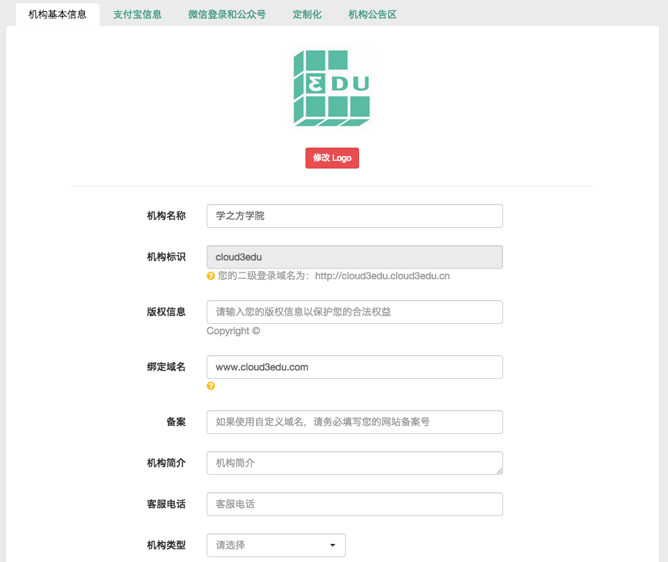

其中，机构标识是由数字和字母以及"-"组成的独特的标识。该标识会作为机构的二级登录域名。例如一个机构的标识为brightkids，则机构的二级登录域名为 brightkids.cloud3edu.cn。

如果机构希望通过自己的域名访问网校，则机构需要申请自己机构的域名并完成备案，然后将域名填入“绑定域名”。机构可以在自己的域名注册商那里将机构的域名或主域名下面的二级域名映射到上述的二级域名上，映射完成后，机构用户只需访问机构的域名即可访问自己机构的学院。例如一个机构可以把自己的域名 school.brightkids.com 映射到 brightkids.cloud3edu.cn。
完成映射后，机构用户只需在浏览器中访问http://school.brightkids.com，即可进入此机构的学院首页。

##### 2. 添加支付宝信息

如果机构希望出售自己的课程，则需要提供机构的支付宝账号信息。学员缴纳的学费直接进入该支付宝账号。我们将陆续添加其他的支付方式。

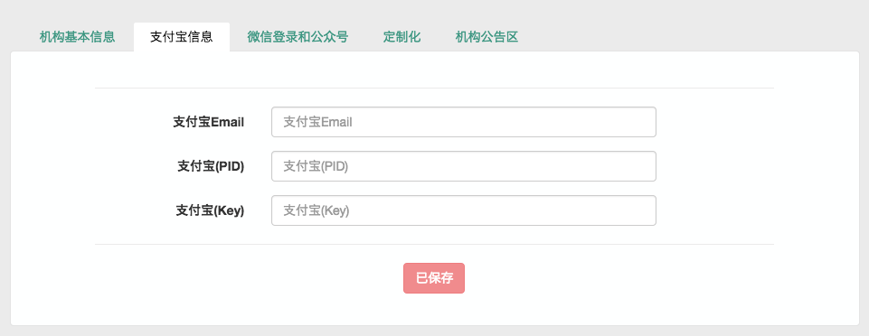

##### 3. 微信登录和公众号

如果机构希望支持用户通过微信扫码登录和通过机构公众号学习，则需要提供微信开放平台的绑定域名, AppId, AppSecret, 以及微信公众号的AppId和AppSecret。
关于如何获取微信开放平台和公众号认证，请访问微信开放平台和公众平台官网：

[微信开放平台官网](https://open.weixin.qq.com/)

[微信公众平台官网](https://mp.weixin.qq.com/)

如需进一步帮助，请联系我们。

##### 4. 定制化

机构可以定制首页上的滚动横幅用于机构宣传和营销。横幅图片的宽高比为4:1，推荐使用尺寸为宽1400px，高350px的图片。

机构还可以在“关于我们”编辑框内编写基于富文本的机构介绍，并预览效果。

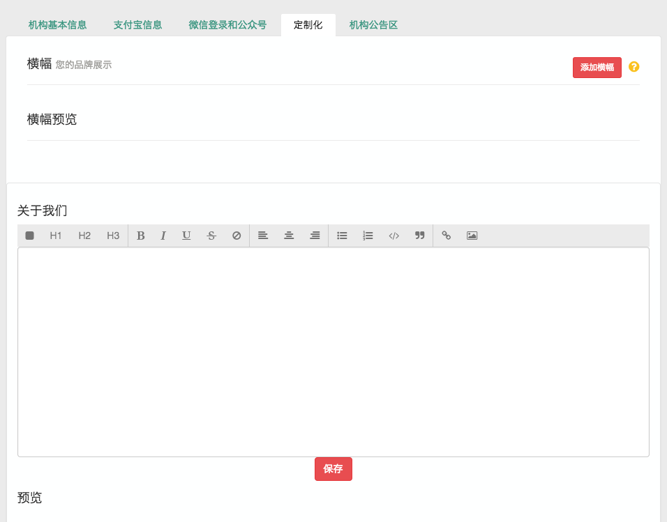

##### 5. 机构公告区

机构公告区内可以发送公告给整个机构。

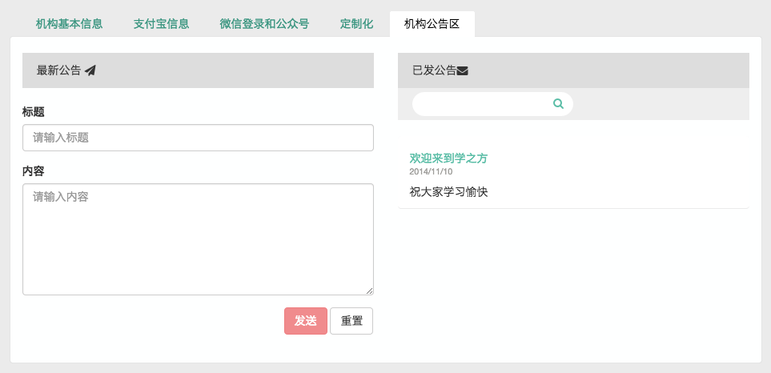

### 二 教师管理

##### 1. 单独添加教师。

如下图。填入所需的教师邮箱。该教师会收到一封来自系统的电子邮件，点击其中的激活链接即可使用临时密码登录云立方学院系统。我们推荐用户登录后立即修改密码。

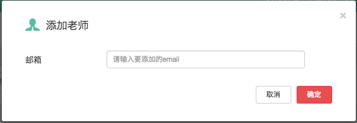

##### 2. 批量添加教师。

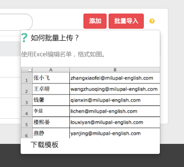

批量添加教师需要上传excel文件（.xlsx）。文件内容格式为：

第一栏为用户姓名，第二栏为用户电子邮件。导入完成后系统会自动发邀请邮件给导入的电子邮件。用户收到邀请邮件后，点击激活链接即可使用临时密码登录云立方学院系统。我们推荐用户登录后立即修改密码。

### 三 专业管理

##### 1. 添加专业

点击添加专业按钮可添加新专业。

##### 2. 查看某专业内的课程列表

选择专业列表中的一个专业，可以查看该专业的所有课程。

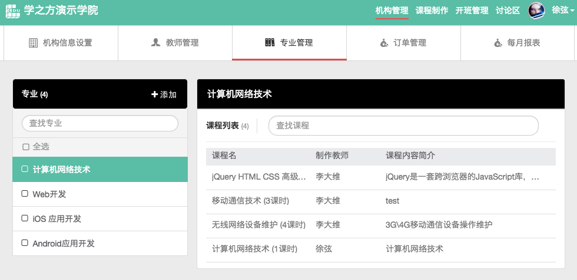

##### 3. 课程统计信息

点击具体课程可查看该课程的统计信息

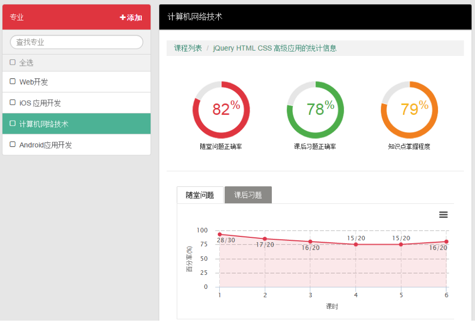

### 四 订单管理

管理员可以查看学员提交的每一笔购买课程订单

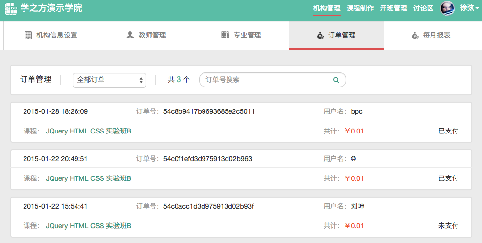

### 五 每月报表

管理员可以查看用户的活跃度和课程购买情况

机构管理员可以同时担任老师的角色，参与课程制作和开班管理。具体功能请参考教师功能部分。

# 教师功能

### 一 制作课程内容

教师和机构管理员都可以制作课程内容。通常一个课程都是由多个课时组成。每个课时里面可以加入视频，讲义，以及问题

##### 1. 添加课程

教师登录之后，首页中点击“添加新课程”可以创建新课程。

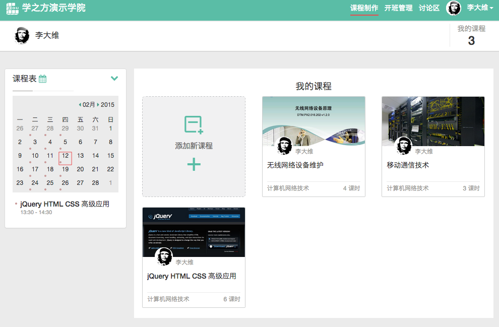

在创建新课程表中，可以添加课程名称，所在专业，并且可以上传课程封面。

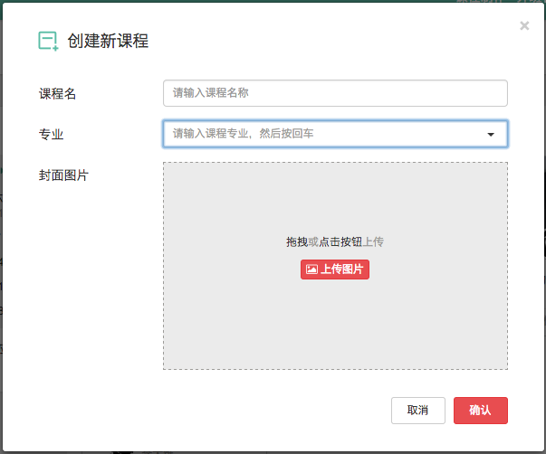

##### 2. 课程关联班级和创建新课时

课程创建后，教师可以在课程主页的左下方班级列表中选择班级，所选的班级会自动关联到该课程。一门课程可以关联多个班级。

在课时列表的右上角，点击添加课时按钮，教师可以为课程创建新的课时。
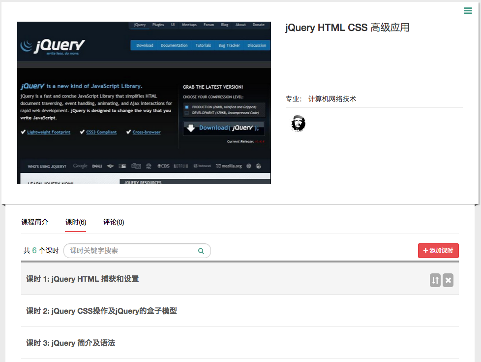

##### 3. 制作课时教学内容
在课时页面，教师可以制作添加课时内容：包括上传教学视频，讲义PPT或跟教学相关的文件。目前支持PPT，WORD和PDF文件格式。

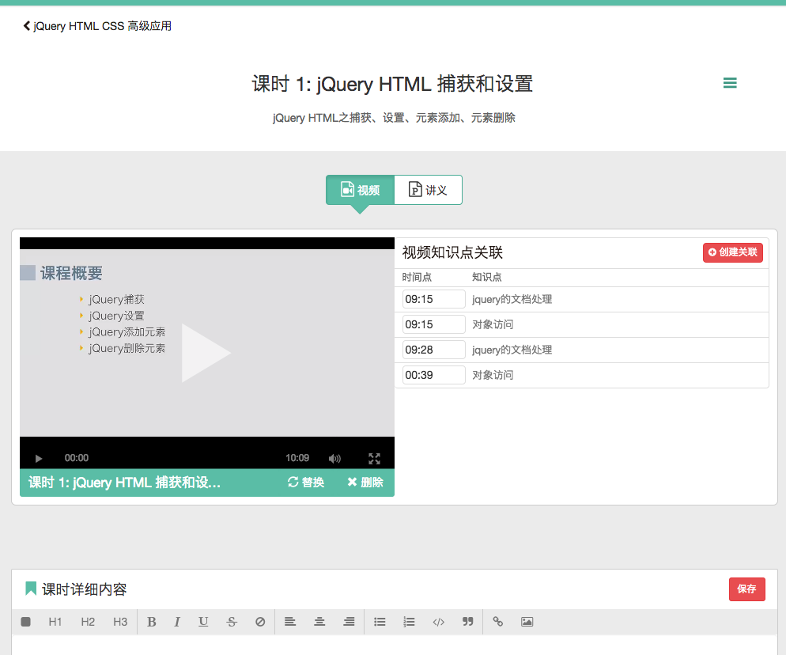

##### 4. 制作随堂练习和课后作业

在课时页面，教师可以制作随堂练习和课后作业。随堂练习是教师在讲课界面中（请看上课界面详细介绍）随时推送给学生的题目。课后作业是课后学生独立完成的作业。目前随堂练习和课后作业支持选择题类型题目。

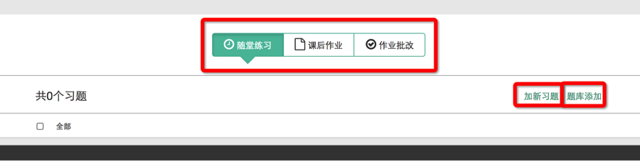

教师可以选择添加新习题，也可以选择从题库中添加。如果选择添加新习题，可以点击“加新习题”按钮，弹出创建习题对话框。问题的题干部分可以是文字或者包含图片。需要至少标记一个选项为正确答案。同时教师可以关联知识点到当前问题，并且提供问题的详细解答。正确答案和详细解答只有当学生提交答案后才在学生界面上显示。

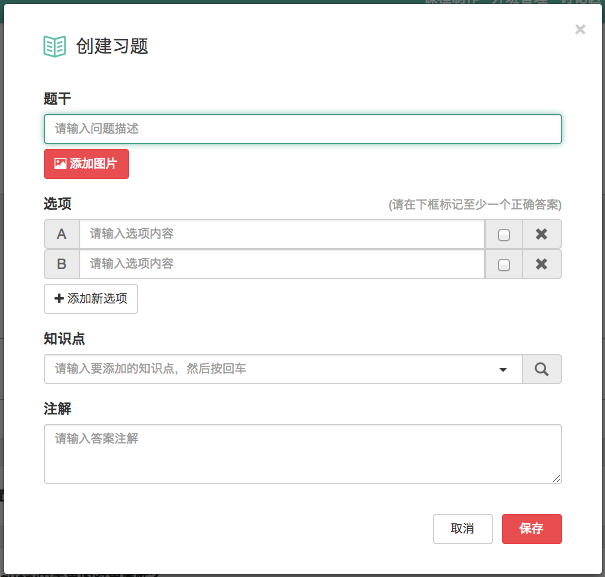

**注：教师创建的题目会自动进入机构题库。同一个机构内，相同专业下的不同课程的题库是共享的。**

如选择从题库添加习题，可点击“题库添加”按钮。在题库界面中教师可以选择一道或多道题目，将其加入随堂练习或课后作业中。在题库界面可以通过关键字来搜索题目，也可以通过知识点来筛选题目。

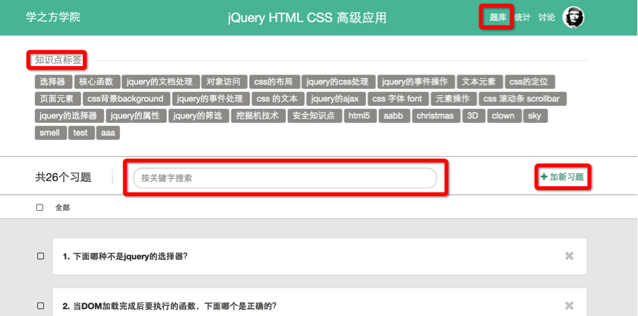

### 二 开班管理

##### 1. 创建新班级
 
教师和机构管理员都可以创建新班级。班级创建后将出现在机构的课程列表中，供机构学员购买；如果是免费课程，机构学员注册后可直接开始学习。

一个班级应当与一份课程内容相关联，多个班级可以共享一份课程内容。换句话说，机构制作一份课程内容后，可以给多个班级使用。

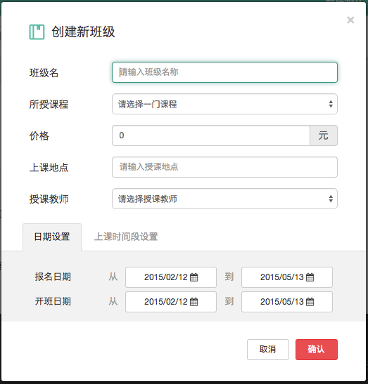

在上图的对话框中，教师可以指定班级的名称，选择相关联的课程，班级的价格，上课地点，添加班级教师，设置报名和开课日期，以及开课的时间段等信息。

班级创建后，将出现在机构课程列表中。

### 三 上课模式

##### 1. 进入上课模式

教师可以从开班管理页面点击班级名称，进入班级课程页面

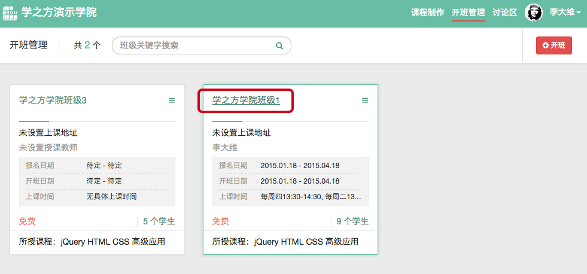

进入班级课程页面后，点击“开始上课”进入上课模式。此种模式下自动进入上次未完成的课时。

教师也可以从班级课程页面的课时列表中，选择希望授课的课时，点击右上角的开始上课按钮，进入上课模式

开班管理页面点击班级名称，在课程页面中，教师先在班级列表中选择要上课的班级，然后在右侧对应的课时列表中，点击课时左侧的小图标，进入上课界面。
在课时界面，教师可以点击“开始上课”按钮，选择要上课的班级，进入上课模式。

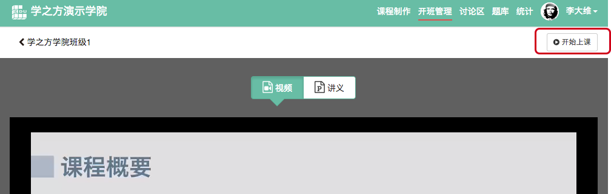

##### 2. 上课模式功能

进入上课模式界面后，教师可以展示和讲解讲义PPT或其它文档，并且可以随时从课前准备的随堂练习中选择题目推送给学生。学生可在自己的电脑或移动设备上回答，教师会收到所有学生的实时回答情况。

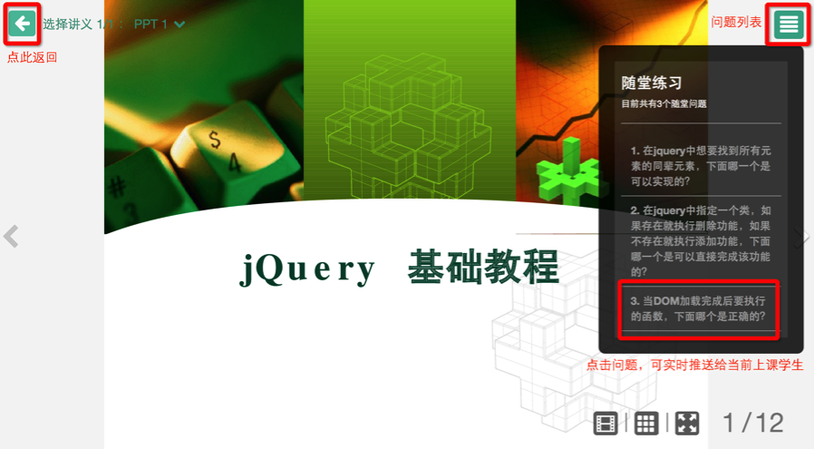

  

下图是教师点击开始提问后看到的学生实时回答统计的情况。包括有多少学生提交了答案，每个选项的人数统计。

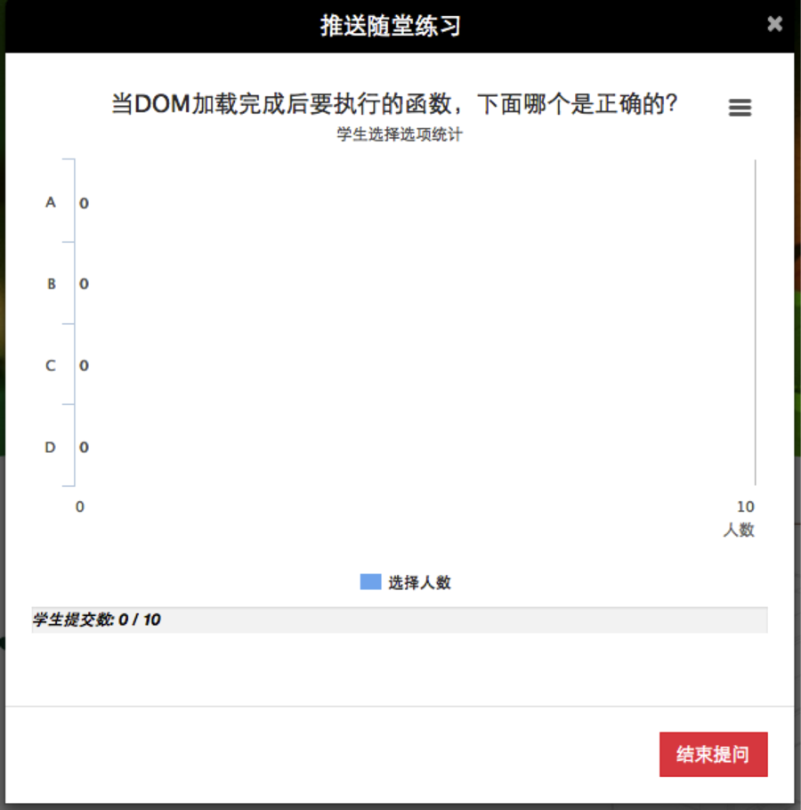

### 三. 课后查看统计

##### 1. 查看随堂练习和课后作业统计

教师可以进入课时页面，查看每个随堂练习或者课后作业的回答统计。统计信息包括回答正确率统计，选项分布，以及每一个学生的回答情况。

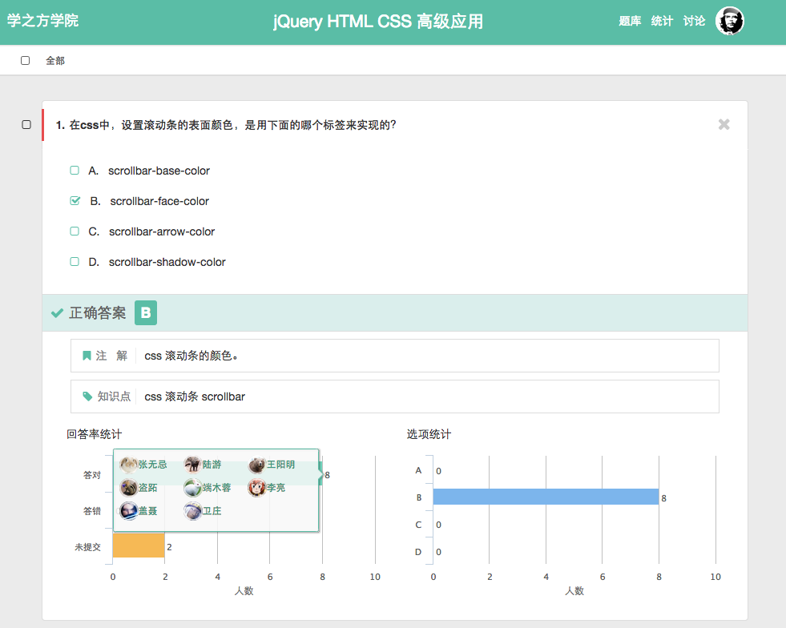

##### 2. 批改学生作业

对于不便用选择题形式呈现的作业题目。系统支持学生上传文件提交作业，教师可以在课时页面的作业批改界面里完成批改工作。

##### 3. 查看课程统计

教师可以随时查看整个课程的统计。

统计数据包括随堂问题正确率，课后习题正确率，以及知识点掌握度。数据既包含整体课程，也包含具体每一个课时的数据，以及每一个知识点的数据。

教师可以从左侧的班级列表中选择班级或单个学生，查看整个班级或者单个学生的统计数据。

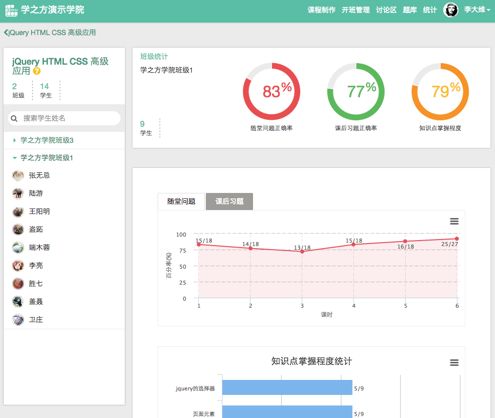

# 学生功能

### 一 学习课程

##### 1. 进入课程

学生登录系统后，可以在个人主页上看到自己正在学习的课程和课程表。

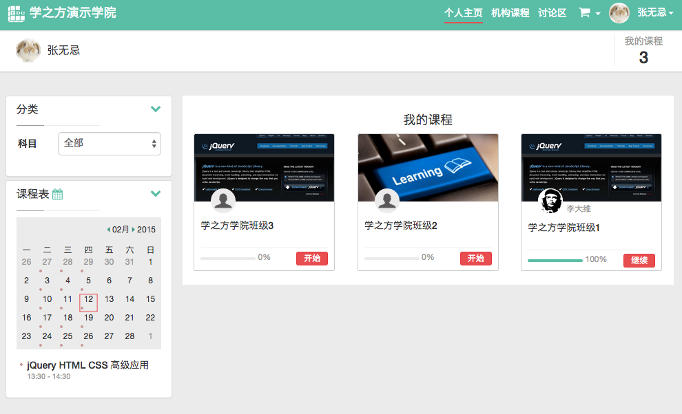

点击课程进入课程主页。进入课程主页后，可以看到课程教师，课程简介，以及课程学习进度，以及课时列表。可以点击继续学习按钮进入到当前正在学习的课时，也可以直接点击某个课时进入并开始学习。

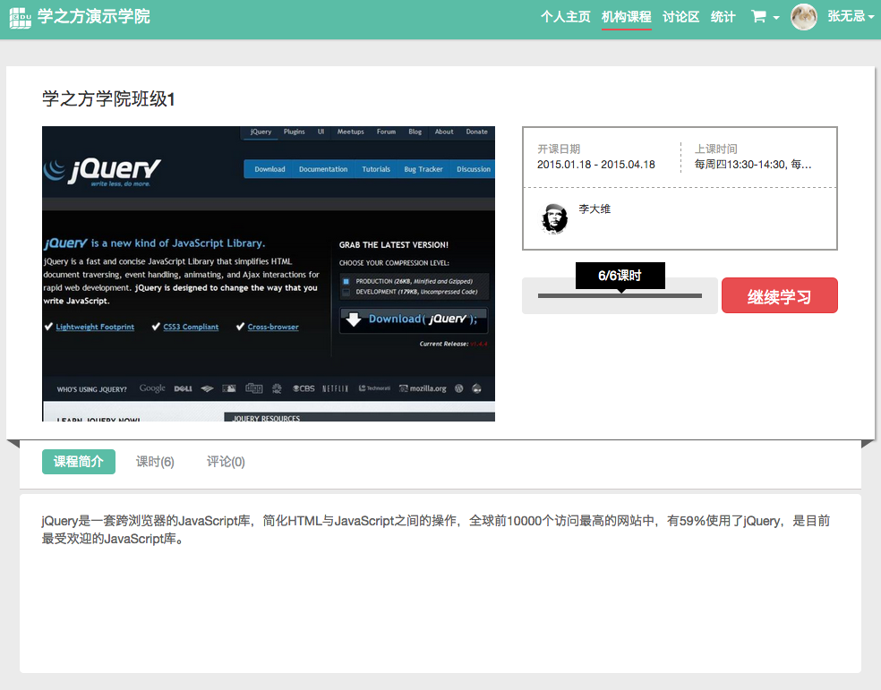

##### 2. 进入课程

进入课时页面后，学生可以观看教学视频，或者浏览教学PPT。

学生还可以复习教师在课堂上发布的随堂问题，以及完成课后作业习题。目前课后作业支持选择题。 

##### 3. 上传作业

如果学生需要提交其它类型的作业，可以选择上传作业文件，如图片等，并提交给教师批阅

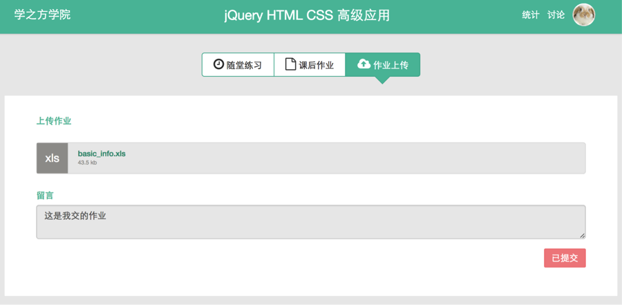

##### 4. 查看个人统计

学生可以点击统计进入自己的学习统计界面。统计界面中显示学生本门课程的统计信息。统计信息包括课程的总体统计信息，以及每个课时的趋势变化。统计信息还包括学生对课程中的知识点掌握情况。

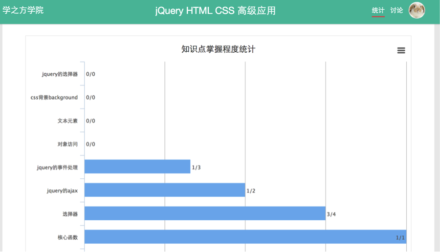

# 通用功能

### 一 微信扫码注册登录

如果机构已经完成了机构的微信开放平台和微信公众号的认证，并在机构管理中正确输入了相关信息，则机构学员可以使用微信扫码直接注册并登录机构网校。

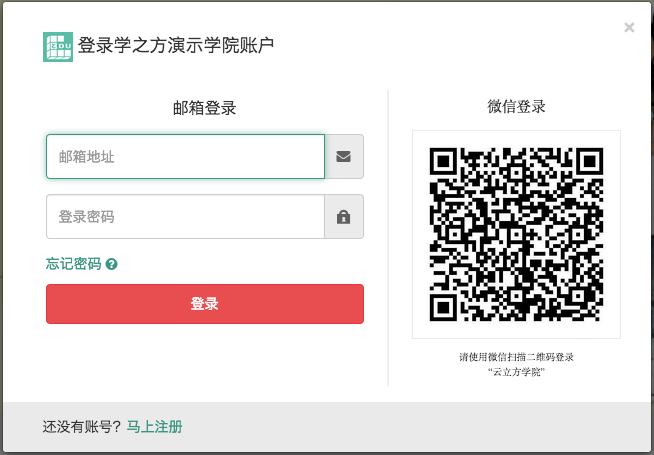

### 二 个人设置

登录后点击用户头像，再点击个人设置。

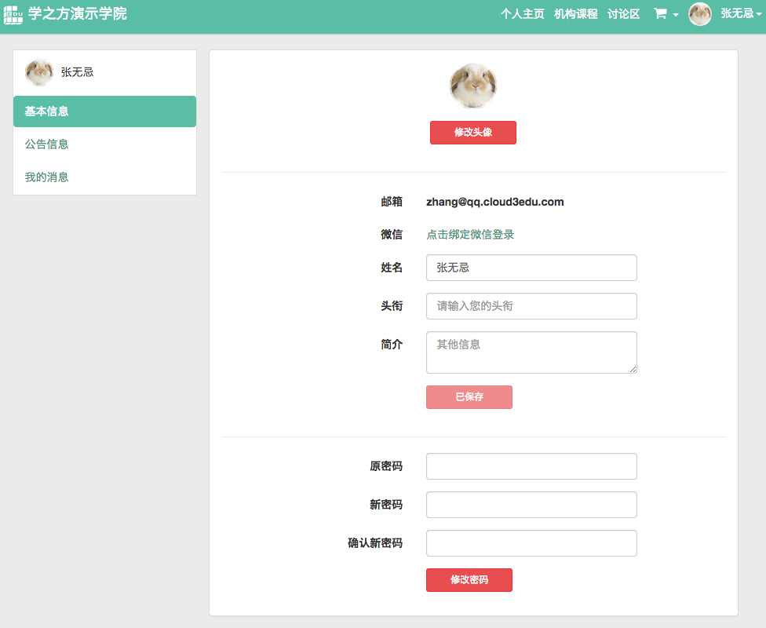

对于机构学员而言，如果学员是使用邮箱注册的，则在个人设置中可以绑定微信登录；如果是使用微信注册登录的，则可以绑定邮箱。

对于机构教师而言，因为教师不开放注册，而是由管理员通过教师邮箱添加的，所以教师登录后，可以在个人设置中通过邮箱绑定微信，之后可以使用微信扫码直接登录。

在个人设置页面中，可修改个人设置数据，包括头像，姓名，密码和简介。修改头像时，可以手动裁剪上传的图片中想要的部分。

### 三 查看讨论区及提问

进入讨论区后，可以看到机构的讨论板块。

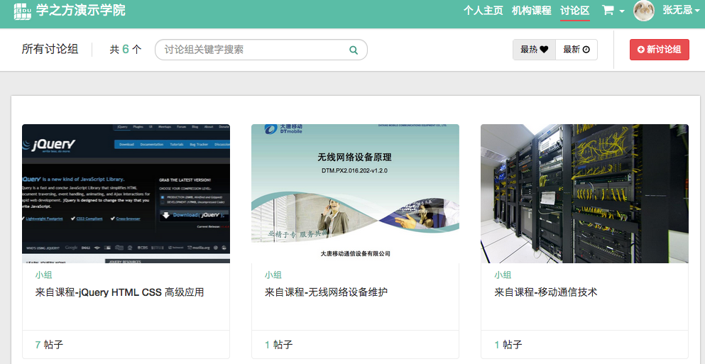

点击一个板块进入该讨论区后，可点击新讨论按钮发起新的讨论主题。

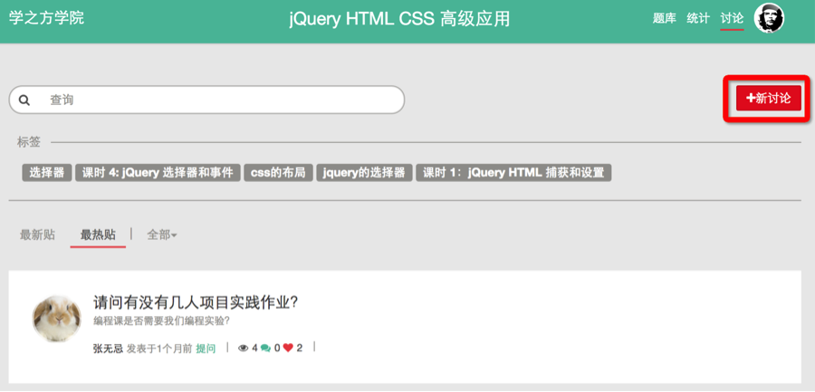

在讨论主题编辑框中，可以指定讨论主题，类型(目前支持提问和公告类型)，并可以将该主题与一个或多个课时及知识点关联起来，便于大家查找和分类。点击编辑框的左下角的图片icon，可以在讨论内容中插入图片。

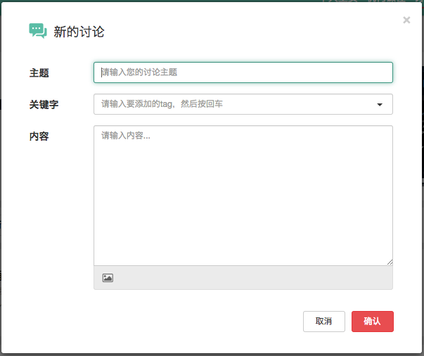

在讨论区中，用户可以点击某一个主题查看主题细节，也可以点赞或回复主题。
  

<a href="#" class="to-top">
  回到顶部
</a>

  </body>
</html>

